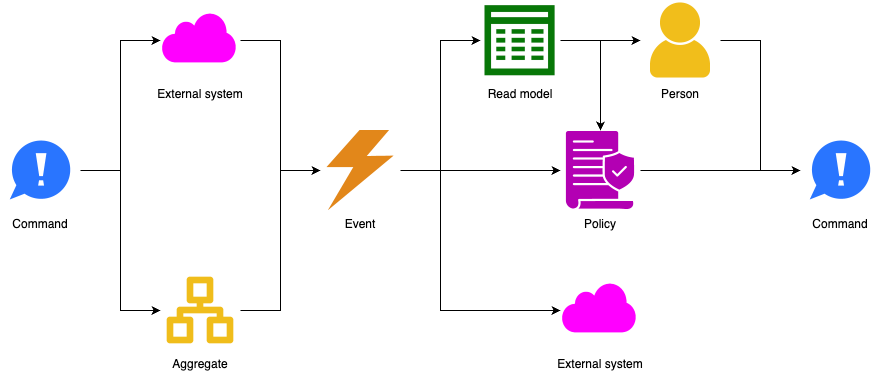

# Putting it all together

Software development is a _process_ that results in running software, which is a _process_ that automates part of a
larger _process_.
Given how central the notion of a process is to software development, it's surprising to see how little attention it
gets.
Most architectural descriptions of software systems, for example, focus on its static structure.
We can gain much by rectifying this oversight.

The following synthesis of the preceding material attempts to do just that.


## Requirements

The standard notation to capture processes is Business Process Model and Notation (BPMN) @@BPMN2013.
However, this notation is complex: it has many symbols and nuances.
These complexities are necessary to fulfill a major goal of BPMN: execute processes based on the model alone.
As such, BPMN is more a tool for design and construction than for requirements gathering.
A major problem using it for capturing requirements is that stakeholders have a hard time reading it and can therefore
not validate the requirements.

Other notations exist for describing processes, like activity diagrams and sequence diagrams @@UML.
These notations are simpler, but rather generic, containing not much more than actors, their actions, and some data
flows.
This makes it hard to use them to capture requirements and then derive a design from those requirements.
It's left to the designer to take a giant intellectual leap.

I believe event storming @@Brandolini2013 can fill the gap between these two sets of notations.
The concepts of events, commands, persons, external systems, and so on are easy to explain in a workshop format,
especially when introduced gradually.
The grammar that rules the concepts helps with uncovering requirements by directing participants to answer the right
questions.
The concepts are also powerful enough to turn requirements gathering smoothly into design.

The only downside of event storming is that it doesn't come with a formal notation like BPMN or UML.
It's easy to replace the colored stickies with simarly colored icons, however, and connect them with arrows:



We call this Rigorous Event Storming Icon Notation (RESIN).


## Design

```admonish info "Ideas"
- Code smells & refactoring
- ASTs
- Structure editors
```

## Construction

```admonish info "Ideas"
- As tests get more specific, code gets more generic
- Transformations
- Breaking up the monolith
```

## Testing

```admonish info "Ideas"
- TDD
- TDD inside BDD
```
